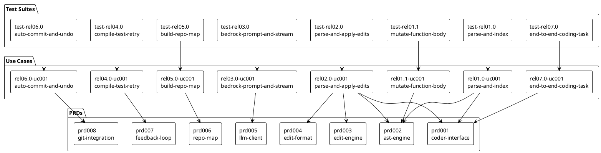

# go-coder Specifications

## Overview

go-coder is a Go library that turns an LLM into a coding agent. It takes a natural language prompt, assembles repository context, sends it to AWS Bedrock, parses the response into file edits, applies them, verifies the result, and retries on failure. We describe the project goals and boundaries in [VISION.md](VISION.md) and the system components, interfaces, and design decisions in [ARCHITECTURE.md](ARCHITECTURE.md).

This document ties together the PRDs, use cases, test suites, and roadmap into one navigable page. Each entry summarizes the artifact in a sentence or two and shows how it relates to the others. The detail lives in the linked files.

## Roadmap Summary

Table 1 Roadmap Summary

| Release | Name | Use Cases (done / total) | Status |
|---------|------|--------------------------|--------|
| 01.0 | AST Foundation | 0 / 1 | not started |
| 01.1 | AST Mutation | 0 / 1 | not started |
| 02.0 | Edit Format and Text Edits | 0 / 1 | not started |
| 03.0 | LLM Integration | 0 / 1 | not started |
| 04.0 | Feedback Loop | 0 / 1 | not started |
| 05.0 | Repository Map | 0 / 1 | not started |
| 06.0 | Git Integration | 0 / 1 | not started |
| 07.0 | CLI and Orchestrator Integration | 0 / 1 | not started |

## PRD Index

Table 2 PRD Index

| PRD | Title | Summary |
|-----|-------|---------|
| [prd001-coder-interface](specs/product-requirements/prd001-coder-interface.yaml) | Coder Public Interface | Defines the stable public API (Config, Coder interface, Result) that callers use to invoke the coding agent |
| [prd002-ast-engine](specs/product-requirements/prd002-ast-engine.yaml) | Go AST Engine | Covers file scanning, symbol table construction, AST mutation, and comment-preserving write-back for Go source files |
| [prd003-edit-engine](specs/product-requirements/prd003-edit-engine.yaml) | Text Edit Engine | Specifies the text-based search/replace engine for non-Go files with multi-stage matching (exact, whitespace-normalized, fuzzy) |
| [prd004-edit-format](specs/product-requirements/prd004-edit-format.yaml) | Edit Format Parser | Defines parsing of LLM response text into structured edit instructions and routing edits to the appropriate engine |
| [prd005-llm-client](specs/product-requirements/prd005-llm-client.yaml) | AWS Bedrock LLM Client | Specifies the Bedrock ConverseStream integration, prompt construction, token streaming, and token tracking |
| [prd006-repo-map](specs/product-requirements/prd006-repo-map.yaml) | Repository Map | Covers tree-sitter symbol extraction, dependency graph construction, PageRank ranking, and token-budget-constrained rendering |
| [prd007-feedback-loop](specs/product-requirements/prd007-feedback-loop.yaml) | Compiler and Test Feedback Loop | Defines the compile, vet, test, error formatting, and retry cycle that turns approximate LLM output into working code |
| [prd008-git-integration](specs/product-requirements/prd008-git-integration.yaml) | Git Integration | Specifies auto-commit with attribution, dirty file handling, commit message generation, and undo capability |
| [prd009-technology-stack](specs/product-requirements/prd009-technology-stack.yaml) | Technology Stack and Project Structure | Defines the Go module, dependencies, directory layout, test CLI flags, and Mage build automation |

## Use Case Index

Table 3 Use Case Index

| Use Case | Title | Release | Status | Test Suite |
|----------|-------|---------|--------|------------|
| [rel01.0-uc001-parse-and-index](specs/use-cases/rel01.0-uc001-parse-and-index.yaml) | Parse and Index a Go Repository | 01.0 | not started | [test-rel01.0-uc001-parse-and-index](specs/test-suites/test-rel01.0-uc001-parse-and-index.yaml) |
| [rel01.1-uc001-mutate-function-body](specs/use-cases/rel01.1-uc001-mutate-function-body.yaml) | Mutate Go Function Body via AST | 01.1 | not started | [test-rel01.1-uc001-mutate-function-body](specs/test-suites/test-rel01.1-uc001-mutate-function-body.yaml) |
| [rel02.0-uc001-parse-and-apply-edits](specs/use-cases/rel02.0-uc001-parse-and-apply-edits.yaml) | Parse LLM Response and Apply Edits | 02.0 | not started | [test-rel02.0-uc001-parse-and-apply-edits](specs/test-suites/test-rel02.0-uc001-parse-and-apply-edits.yaml) |
| [rel03.0-uc001-bedrock-prompt-and-stream](specs/use-cases/rel03.0-uc001-bedrock-prompt-and-stream.yaml) | Send Coding Prompt to Bedrock and Stream Response | 03.0 | not started | [test-rel03.0-uc001-bedrock-prompt-and-stream](specs/test-suites/test-rel03.0-uc001-bedrock-prompt-and-stream.yaml) |
| [rel04.0-uc001-compile-test-retry](specs/use-cases/rel04.0-uc001-compile-test-retry.yaml) | Compile, Test, and Retry on Failure | 04.0 | not started | [test-rel04.0-uc001-compile-test-retry](specs/test-suites/test-rel04.0-uc001-compile-test-retry.yaml) |
| [rel05.0-uc001-build-repo-map](specs/use-cases/rel05.0-uc001-build-repo-map.yaml) | Build Ranked Repository Map | 05.0 | not started | [test-rel05.0-uc001-build-repo-map](specs/test-suites/test-rel05.0-uc001-build-repo-map.yaml) |
| [rel06.0-uc001-auto-commit-and-undo](specs/use-cases/rel06.0-uc001-auto-commit-and-undo.yaml) | Auto-Commit Edits and Undo | 06.0 | not started | [test-rel06.0-uc001-auto-commit-and-undo](specs/test-suites/test-rel06.0-uc001-auto-commit-and-undo.yaml) |
| [rel07.0-uc001-end-to-end-coding-task](specs/use-cases/rel07.0-uc001-end-to-end-coding-task.yaml) | End-to-End Coding Task | 07.0 | not started | [test-rel07.0-uc001-end-to-end-coding-task](specs/test-suites/test-rel07.0-uc001-end-to-end-coding-task.yaml) |

## Test Suite Index

Table 4 Test Suite Index

| Test Suite | Title | Traces | Test Cases |
|------------|-------|--------|------------|
| [test-rel01.0-uc001-parse-and-index](specs/test-suites/test-rel01.0-uc001-parse-and-index.yaml) | Parse and index Go repository | rel01.0-uc001-parse-and-index | 8 |
| [test-rel01.1-uc001-mutate-function-body](specs/test-suites/test-rel01.1-uc001-mutate-function-body.yaml) | AST mutation of Go function bodies | rel01.1-uc001-mutate-function-body | 8 |
| [test-rel02.0-uc001-parse-and-apply-edits](specs/test-suites/test-rel02.0-uc001-parse-and-apply-edits.yaml) | Parse and apply edit blocks from LLM response | rel02.0-uc001-parse-and-apply-edits | 10 |
| [test-rel03.0-uc001-bedrock-prompt-and-stream](specs/test-suites/test-rel03.0-uc001-bedrock-prompt-and-stream.yaml) | Bedrock prompt construction and response streaming | rel03.0-uc001-bedrock-prompt-and-stream | 9 |
| [test-rel04.0-uc001-compile-test-retry](specs/test-suites/test-rel04.0-uc001-compile-test-retry.yaml) | Compiler and test feedback loop | rel04.0-uc001-compile-test-retry | 7 |
| [test-rel05.0-uc001-build-repo-map](specs/test-suites/test-rel05.0-uc001-build-repo-map.yaml) | Repository map construction and ranking | rel05.0-uc001-build-repo-map | 7 |
| [test-rel06.0-uc001-auto-commit-and-undo](specs/test-suites/test-rel06.0-uc001-auto-commit-and-undo.yaml) | Git auto-commit and undo operations | rel06.0-uc001-auto-commit-and-undo | 8 |
| [test-rel07.0-uc001-end-to-end-coding-task](specs/test-suites/test-rel07.0-uc001-end-to-end-coding-task.yaml) | End-to-end coding task execution | rel07.0-uc001-end-to-end-coding-task | 6 |

## PRD-to-Use-Case Mapping

Table 5 PRD-to-Use-Case Mapping

| Use Case | PRD | Why Required | Coverage |
|----------|-----|--------------|----------|
| rel01.0-uc001-parse-and-index | prd001-coder-interface | Uses Symbol and SymbolKind shared types | Partial (R5 only) |
| rel01.0-uc001-parse-and-index | prd002-ast-engine | Exercises file scanning and symbol table construction | Partial (R1, R2) |
| rel01.1-uc001-mutate-function-body | prd002-ast-engine | Validates AST mutation, write-back, and comment preservation | Partial (R3, R4, R5) |
| rel02.0-uc001-parse-and-apply-edits | prd001-coder-interface | Uses the Edit struct for representing file edits | Partial (R5 only) |
| rel02.0-uc001-parse-and-apply-edits | prd002-ast-engine | Routes Go file edits through AST mutation | Partial (R3 only) |
| rel02.0-uc001-parse-and-apply-edits | prd003-edit-engine | Exercises text-based search/replace with multi-stage matching | Partial (R1, R2) |
| rel02.0-uc001-parse-and-apply-edits | prd004-edit-format | Validates parsing of SEARCH/REPLACE blocks and edit routing | Partial (R1, R4, R5) |
| rel03.0-uc001-bedrock-prompt-and-stream | prd005-llm-client | Exercises the full Bedrock client lifecycle: connect, prompt, stream, track tokens | Full (R1-R5) |
| rel04.0-uc001-compile-test-retry | prd007-feedback-loop | Validates compiler verification, error formatting, and retry logic | Partial (R1, R2, R3, R4) |
| rel05.0-uc001-build-repo-map | prd006-repo-map | Exercises symbol extraction, dependency graph, PageRank, and rendering | Partial (R1-R4) |
| rel06.0-uc001-auto-commit-and-undo | prd008-git-integration | Validates auto-commit, dirty handling, commit messages, and undo | Partial (R1-R4) |
| rel07.0-uc001-end-to-end-coding-task | prd001-coder-interface | Exercises the full Coder interface: Config, New, Run, Result | Partial (R2) |

## Traceability Diagram

|  |
|:--:|

|Figure 1 Traceability between PRDs, use cases, and test suites |

## Coverage Gaps

We identified the following gaps in the current specification coverage.

Table 6 Coverage Gaps

| Gap Type | Artifact | Notes |
|----------|----------|-------|
| PRD not exercised by any use case | prd009-technology-stack | Defines project structure and build automation; validated implicitly when any code compiles and builds |
| PRD partially covered | prd001-coder-interface | R1 (Config), R3 (Result), R4 (Constructor), R6 (Error Types) not directly exercised by a dedicated use case; covered indirectly by rel07.0-uc001 end-to-end flow |
| PRD partially covered | prd003-edit-engine | R3 (Diagnostics), R4 (File Operations), R5 (Integration) not exercised by rel02.0-uc001 |
| PRD partially covered | prd004-edit-format | R2 (Whole-file blocks), R3 (Edit routing) not fully exercised by rel02.0-uc001 |
| PRD partially covered | prd006-repo-map | R5 (Caching) not exercised by rel05.0-uc001 |
| PRD partially covered | prd007-feedback-loop | R5 (VerifyResult struct) not directly exercised |
| PRD partially covered | prd008-git-integration | R5 (Git operations library choice) not directly exercised |

These gaps are acceptable at this stage. The end-to-end use case (rel07.0-uc001) exercises the full pipeline and implicitly touches most remaining requirements. As implementation proceeds, we may add focused use cases to cover specific gaps.
